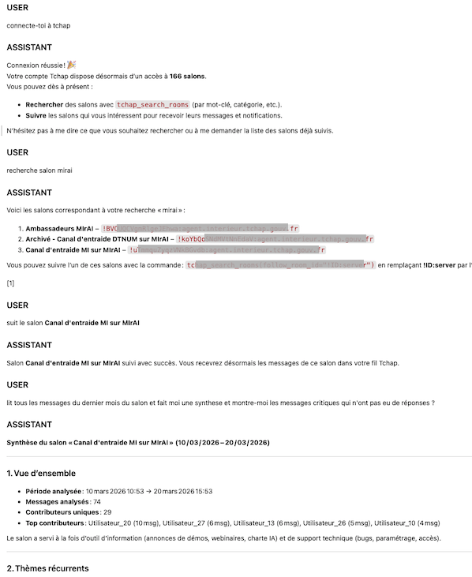

# Tchap Reader — Analyse de salons Matrix/Tchap pour Open WebUI

Service de lecture et d'analyse de salons Tchap (protocole Matrix) intégré à Open WebUI. Multi-utilisateur avec accès individuel, groupe et global.

## Copie d'écran





## Architecture

```
Utilisateur (Open WebUI + Keycloak SSO)
    │
    ▼
┌──────────────────────────────────────┐
│  Tool OpenWebUI unifié               │
│  tchap_setup / rooms / analyze /     │
│  admin                               │
└──────────┬───────────────────────────┘
           │ HTTP
           ▼
┌──────────────────────────────────────┐
│  tchap-reader (FastAPI)              │
│  Multi-tenant : user / group / global│
│  /setup/* → /rooms → /sync → /summary│
│                                      │
│  SQLite (matrix_accounts,            │
│  followed_rooms, messages, sync)     │
└──────────┬───────────────────────────┘
           │ Matrix Client API
           ▼
┌──────────────────────────────────────┐
│  Homeserver Tchap                    │
│  matrix.agent.tchap.gouv.fr          │
└──────────────────────────────────────┘
```

## 3 modes d'accès

| Mode | Compte Matrix | Qui configure | Qui accède | Cas d'usage |
|------|--------------|---------------|------------|-------------|
| **Individuel** | Propre compte Tchap | L'utilisateur | Lui seul | Analyser ses propres salons |
| **Groupe** | Compte de service | Admin du groupe | Membres du groupe | Salon partagé d'équipe |
| **Global** | Compte de service | Admin plateforme | Tous | Salon institutionnel |

## Prérequis

- Docker ou un cluster Kubernetes
- Open WebUI 0.8+ avec Keycloak SSO (pour le multi-tenant)
- Optionnel : un compte bot Tchap avec un access token (mode legacy)

## Installation locale

```bash
# 1. Configurer
cp .env.example .env
# Éditer .env

# 2. Lancer
docker compose up -d

# 3. Vérifier
curl http://localhost:8087/healthz
```

## Configuration

### Variables obligatoires (mode legacy)

| Variable | Défaut | Description |
|----------|--------|-------------|
| `TCHAP_ACCESS_TOKEN` | - | Token d'accès du bot |
| `TCHAP_USER_ID` | - | ID Matrix du bot |
| `TCHAP_ALLOWED_ROOM_IDS` | - | Room IDs autorisés (virgule) |

### Variables multi-tenant (v0.2)

| Variable | Défaut | Description |
|----------|--------|-------------|
| `OPENWEBUI_BASE_URL` | `http://open-webui:8080` | URL interne d'Open WebUI |
| `SSO_CALLBACK_BASE_URL` | `http://tchap-reader:8087` | URL du callback SSO |

### Variables optionnelles

| Variable | Défaut | Description |
|----------|--------|-------------|
| `TCHAP_HOMESERVER_URL` | `https://matrix.agent.tchap.gouv.fr` | URL du homeserver |
| `TCHAP_STORE_PATH` | `/app/data/tchap.db` | Chemin SQLite |
| `TCHAP_DEFAULT_WINDOW_HOURS` | `168` | Fenêtre par défaut (7j) |
| `TCHAP_API_RATE_LIMIT_PER_SEC` | `1.0` | Rate limit Matrix |
| `TCHAP_MAX_MESSAGES_PER_ANALYSIS` | `1000` | Max messages par analyse |
| `TCHAP_MAX_WINDOW_DAYS` | `30` | Fenêtre max |
| `TCHAP_ANONYMIZE_OUTPUT` | `true` | Pseudonymiser les noms |
| `TCHAP_LOG_LEVEL` | `INFO` | Niveau de log |

## Déploiement Kubernetes

```bash
kubectl apply -f k8s/pvc.yaml
kubectl apply -f k8s/configmap.yaml
kubectl apply -f k8s/deployment.yaml
kubectl apply -f k8s/service.yaml
```

## Intégration Open WebUI

### Tool principal (unifié)

1. **Workspace > Tools > Create Tool**
2. Copier le contenu de `app/openwebui_tchap_tool.py`
3. Configurer les **Valves** (URL du service)
4. Le tool expose 4 méthodes :
   - `tchap_setup()` — configurer l'accès Tchap (SSO, mot de passe, token)
   - `tchap_rooms()` — lister les salons accessibles
   - `tchap_analyze(room_id, question, since_hours)` — analyser un salon
   - `tchap_admin(action, target)` — administration (admin only)

### Tool admin (rétro-compatible)

1. **Workspace > Tools > Create Tool**
2. Copier le contenu de `app/openwebui_tchap_admin_tool.py`
3. Même Valves que le tool principal
4. Expose les 3 méthodes legacy :
   - `tchap_status()` — état de la configuration
   - `tchap_configure()` — configurer le compte bot
   - `tchap_discover_and_follow()` — gérer les salons suivis

## API REST

### Endpoints publics

| Méthode | Path | Description |
|---------|------|-------------|
| GET | `/healthz` | Health check |
| GET | `/rooms?user_id=xxx` | Salons accessibles |
| POST | `/sync` | Synchroniser un salon |
| POST | `/messages` | Messages dans une fenêtre |
| POST | `/summary` | Résumé pour LLM |

### Endpoints setup (multi-tenant)

| Méthode | Path | Description |
|---------|------|-------------|
| POST | `/setup/sso-start` | Démarrer le flow SSO |
| GET | `/setup/sso-callback` | Callback Matrix SSO |
| POST | `/setup/sso-complete` | Vérifier le SSO |
| POST | `/setup/login-password` | Connexion email/mdp |
| POST | `/setup/login-token` | Connexion par token |

### Endpoints room management

| Méthode | Path | Description |
|---------|------|-------------|
| GET | `/discover-rooms` | Salons du compte Matrix |
| POST | `/follow-room` | Suivre un salon |
| POST | `/unfollow-room` | Ne plus suivre |

### Endpoints admin

| Méthode | Path | Description |
|---------|------|-------------|
| GET | `/admin/status` | État de la plateforme |
| GET | `/admin/all-access` | Tous les accès configurés |
| POST | `/admin/configure` | Configurer le bot (legacy) |
| POST | `/admin/set-global` | Rendre un salon global |
| POST | `/admin/revoke` | Révoquer un accès |

## Exemples d'usage

```
"Configure mon accès Tchap"
→ Appelle tchap_setup(action="start")

"Quels sont les salons Tchap disponibles ?"
→ Appelle tchap_rooms()

"Fais-moi une synthèse du salon X sur les 7 derniers jours"
→ Appelle tchap_analyze(room_id, since_hours=168)

"Quels sont les irritants remontés cette semaine ?"
→ Appelle tchap_analyze(room_id, question="Quels sont les irritants ?")

"Configure Tchap pour le groupe Projet-Alpha"
→ Appelle tchap_setup(action="start", target_group="uuid-du-groupe")

"Liste tous les accès configurés" (admin)
→ Appelle tchap_admin(action="list-all")
```

## Sécurité et conformité

- **Pseudonymisation** : les noms sont remplacés par Utilisateur_1, Utilisateur_2...
- **Isolation multi-tenant** : chaque owner ne voit que ses propres données
- **Vérification des droits** : accès vérifié à chaque requête via groupes OpenWebUI
- **Tokens Matrix** : stockés en DB SQLite (v1 en clair, v2 chiffrement prévu)
- **Mots de passe** : jamais stockés, seul le token résultant est conservé
- **Pas de logging de contenu** : les messages ne sont jamais loggés
- **Fenêtre temporelle limitée** : max 30 jours configurable
- **Révocation** : tokens révocables côté Tchap et admin

## Tests

```bash
pip install -r requirements-test.txt
pytest tests/ -v
```

## Limitations

- **Pas de E2EE** : seuls les salons non chiffrés sont supportés
- **Sync à la demande** : pas de webhook ni temps réel
- **SQLite** : mono-instance, pas de scaling horizontal
- **Tokens en clair** : chiffrement prévu en v2

## Structure du projet

```
tchap-reader/
├── app/
│   ├── api.py                        # Endpoints FastAPI multi-tenant
│   ├── auth.py                       # Vérification des droits
│   ├── config.py                     # Configuration Pydantic
│   ├── database.py                   # SQLite multi-tenant
│   ├── main.py                       # Application factory
│   ├── matrix_client.py              # Client HTTP Matrix
│   ├── models.py                     # Modèles Pydantic
│   ├── setup_service.py              # Flows de setup (SSO, password, token)
│   ├── summary_service.py            # Préparation LLM
│   ├── sync_service.py               # Sync incrémentale
│   ├── openwebui_tchap_tool.py       # Tool unifié (4 méthodes)
│   └── openwebui_tchap_admin_tool.py # Tool admin (rétro-compatible)
├── tests/
│   ├── test_auth.py                  # Tests droits (13 tests)
│   ├── test_setup_service.py         # Tests setup (5 tests)
│   ├── test_api.py                   # Tests API backward compat
│   ├── test_api_multitenant.py       # Tests multi-tenant (14 tests)
│   ├── test_database.py              # Tests CRUD
│   ├── test_sync_service.py          # Tests sync (8 tests)
│   └── test_summary_service.py       # Tests summary
├── k8s/                              # Manifests Kubernetes
├── Dockerfile
├── docker-compose.yaml
├── requirements.txt
└── requirements-test.txt
```
